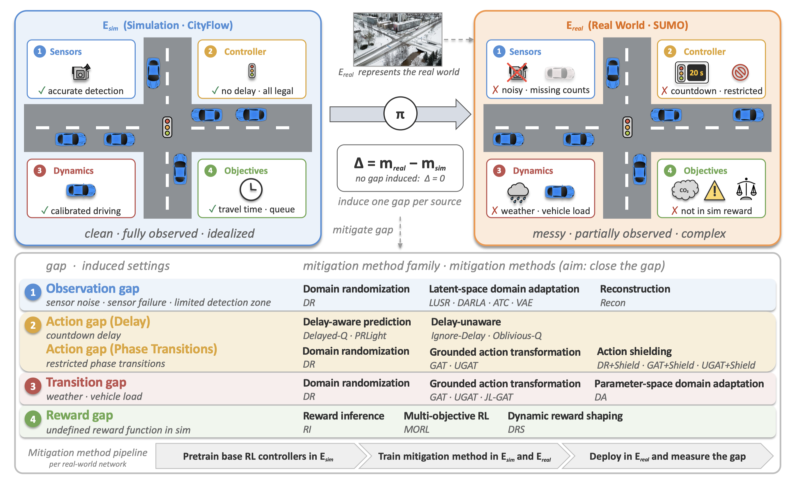
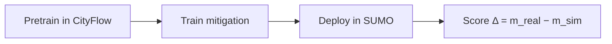

<div align="center">

# Sim2Signal: Sim-to-Real Benchmarks for Traffic Signal Control

[](https://arxiv.org/abs/2609.01676)
[](https://www.python.org/downloads/)
[](https://github.com/DaRL-LibSignal/Sim2Signal)
[](https://darl-libsignal.github.io/Sim2SignalWebsite/)
[](https://github.com/DaRL-LibSignal/Sim2Signal)

<p align="center">
  <a href="https://darl-libsignal.github.io/Sim2SignalWebsite/"></a>
  &nbsp;&nbsp;
  <a href="https://github.com/DaRL-LibSignal/Sim2Signal"></a>
</p>

<p align="center">
  
</p>

[**Quick Start**](#-quick-start) ·
[**Run an Experiment**](#-run-an-experiment) ·
[**Features**](#-features) ·
[**Tables & Figures**](#-tables-and-figures) ·
[**FAQ**](#-faq)


</div>

A benchmark for measuring the sim-to-real gap in reinforcement-learning traffic signal control, and for testing the methods meant to close it. Policies train in CityFlow (sim) and transfer to SUMO (real) under controlled perturbations of each MDP component: **observations**, **actions**, **transitions**, and **rewards**.

```bibtex
@misc{rafi2026sim2signal,
  title={Sim2Signal: Sim-to-Real Benchmarks for Traffic Signal Control},
  author={Al Rafi, Ferdous and Mukherjee, Susrik and Dekate, Latika Liladhar and Lavoe, Jennifer Yawa and Yao, Huaiyuan and Mohanty, Shlok and Da, Longchao and Zhou, Xuesong and Wei, Hua},
  year={2026},
  eprint={2609.01676},
  archivePrefix={arXiv},
  primaryClass={cs.LG},
  url={https://arxiv.org/abs/2609.01676},
}
```

---

### 📰 News

> **[2026.9.3]** Sim2Signal is on [arXiv](https://arxiv.org/abs/2609.01676) — 18 mitigation methods, 2 base controllers, 33 gap settings, 10 calibrated networks.
>
> **[2026.9.18]** Tutorial at [IEEE ITSC 2026](https://darl-libsignal.github.io/Sim2SignalWebsite/tutorial.html) (Naples): *Bridging the Sim-to-Real Gap in Traffic Engineering*.

---

## ✨ Features

| Feature | Description |
|---------|-------------|
| 🧩 **Four gap sources** | The sim-to-real gap is split along the MDP tuple: observation (sensor noise, failures, detection-zone limits), action (execution delay and restricted phase transitions), transition (traffic and vehicle dynamics), and reward (objectives the simulator cannot compute). |
| 🎯 **One gap at a time** | Each gap is induced in isolation under a shared protocol, with no-gap as the reference, so the cost of one source is not mixed with the others. |
| 🗺️ **Real-world networks** | Ten calibrated networks from five locations (Tempe, Bullhead, Cologne, Ingolstadt, Hangzhou), from a single intersection to a 16-signal corridor. |
| 🔁 **Sim-to-sim evaluation** | Train in low-fidelity CityFlow, transfer to high-fidelity SUMO as a controllable stand-in for the real world. |
| 🛠️ **18 mitigation methods** | Domain randomization, domain adaptation, grounded action transformation, delay-aware prediction, action shielding, and reward-side approaches, on DQN and PressLight. |
| 📦 **Reproducible pipeline** | Pretrain → train the mitigation → deploy into the “real” environment → measure the gap. Configs, pretrained weights, and paper logs ship with the repo. |

### 🎬 How It Works

Every method follows the same **pretrain → train → deploy** pipeline. Direct-Transfer applies no mitigation and is the reference. The score is Δ = m_real − m_sim (average travel time unless noted).



---

## 🚀 Quick Start

Linux only (tested on Ubuntu; CityFlow does not build on Windows). Python >= 3.10.

### 1. Prerequisites

- **Python 3.10+**
- **build-essential** and **cmake** (CityFlow is built from C++ source)

```bash
sudo apt update && sudo apt install -y build-essential cmake
```

### 2. One-click install

Activate a fresh environment, then:

```bash
git clone https://github.com/DaRL-LibSignal/Sim2Signal.git
cd Sim2Signal
python3 -m venv .venv && source .venv/bin/activate
bash install.sh
```

This installs the Python dependencies, the SUMO Python bindings (`libsumo` wheels bundle the simulator — no system SUMO install needed), builds CityFlow from source, and smoke-tests the imports.

> **Tip**: The first experiment below evaluates a committed pretrained policy. It does no training and finishes in seconds.

### 3. Run a smoke-test experiment

```bash
python run_s2r_actions.py -a dqn -n tempe_1x1 --act_model direct_transfer \
    --real_setting setting2 --prefix my_run
```

<details>
<summary><b>Manual install</b> (CityFlow / SUMO / pip, step by step)</summary>

#### CityFlow

CityFlow 0.1 is used for the experiments (see the [CityFlow docs](https://cityflow.readthedocs.io/en/latest/install.html#)):

```bash
sudo apt update && sudo apt install -y build-essential cmake
git clone https://github.com/cityflow-project/CityFlow.git
cd CityFlow
pip install .
```

Test: `python -c "import cityflow; cityflow.Engine"`

#### SUMO

SUMO 1.26.0 is used through the `libsumo` Python bindings:

```bash
pip install libsumo==1.26.0 traci==1.26.0
```

A system-wide SUMO (`sudo add-apt-repository ppa:sumo/stable && sudo apt-get install sumo sumo-tools`) is optional; the experiments run entirely through libsumo.

Test: `python -c "import libsumo, traci"`

#### Python dependencies

```bash
pip install -r requirements.txt
```

</details>

---

## 🔬 Run an Experiment

Every experiment is one command: pick a **gap** (runner), an **agent**, a **network**, a **mitigation method**, and a **gap setting**.

```bash
python run_s2r_actions.py -a dqn -n tempe_1x1 --act_model direct_transfer \
    --real_setting setting2 --prefix my_run
```

`direct_transfer` evaluates the committed pretrained policy (`pretrained/tsc`) on the real side with zero adaptation — no training, finishes in seconds. Any other method trains first (minutes to hours depending on the network).

| Gap | Runner | Method flag | Methods |
|-----|--------|-------------|---------|
| Observations | `run_s2r_observations.py` (add `--real_world sumo`) | `--obs_model` | `direct_transfer`, `domain_randomization`, `vae`, `darla`, `atc`, `lusr`, `recon_baseline` |
| Transitions | `run_s2r.py` | `-gt` | `direct_transfer`, `domain_randomization`, `domain_adaptation`, `gat`, `ugat`, `jlgat` |
| Actions | `run_s2r_actions.py` | `--act_model` | `direct_transfer`, `naive`, `delayed_q`, `oblivious_q`, `prlight`, `dr`, `dr_noshield`, `gat`, `gat_shield`, `ugat`, `ugat_shield` |
| Rewards | `run_s2r_rewards.py` | `--reward_model` | `direct_transfer`, `reward_inference`, `morl_grid`, `dynamic_reward_shaping`, `reward_oracle` |

**Agents** (`-a`): `dqn`, `presslight` (RL); `fixedtime`, `maxpressure` (non-RL baselines, `direct_transfer` only).

**Networks** (`-n`):

| Scale | Networks |
|-------|----------|
| Single intersection | `tempe_1x1`, `bullhead_1`, `cologne1`, `ingolstadt1`, `hz1x1` |
| Multi-intersection | `tempe_16`, `bullhead_3`, `cologne3`, `ingolstadt7`, `hz4x4` |

**Settings** (`--real_setting`): a YAML under `configs/<task>/settings/` that defines the gap itself:

| Gap | Settings |
|-----|----------|
| Observation | `noise3`…`noise20`, `dz10`…`dz100`, `sensor5`…`sensor70`, `combine1`…`combine4` |
| Transition | `setting1`…`setting4` (light/heavy load, rain, snow) |
| Action delay | `setting1`…`setting4` (20 / 30 / 40 / 60 s) |
| Phase transitions | `cyclic`, `flexible`, `barrier_leading_fixed`, `barrier_lagging_fixed`, `barrier_leading_lagging_fixed` |
| Hidden real reward | `efficiency_aligned`, `emission_heavy`, `fairness_heavy`, `physical_safety_heavy` |

Results land in `data/output_data/<task>/cityflow_<agent>/<network>/<prefix>/logger/` as a tab-separated `*_DTL.log` (one row per evaluation; the `REAL_TEST` rows are the real-side numbers) plus a `*_BRF.log` with per-episode detail. The command above prints a row that matches the shipped log for the same cell under `logs/sim2real_actions/`.

Two batch scripts reproduce whole reference blocks from the committed weights alone:

```bash
# Pretrained policies in both engines — the sim/real reference lines
bash scripts/run_baseline_evals.sh

# fixedtime / maxpressure across all 33 gap settings
bash scripts/run_nonrl_gap_evals.sh
```

---

## 📊 Tables and Figures

`make_figures.ipynb` is the one entry point from raw logs to paper numbers:

1. The first cell rebuilds every `tables/*.csv` from the run logs shipped in `logs/` (via `scripts/gap_tables.py`, the single source of truth for the selection rules).
2. The remaining cells build the paper figures into `Figures/`.

A fresh clone runs it top to bottom with no other inputs.

The `analyze_*.ipynb` notebooks are per-gap exploratory companions (availability matrices, per-network pivots, per-checkpoint travel-time traces). They share the same `scripts/gap_tables.py` builders, so their numbers are the paper numbers by construction.

| Notebook | Gap |
|----------|-----|
| `analyze_observations.ipynb` / `analyze_latent_observations.ipynb` | Observation |
| `analyze_action_delays.ipynb` | Action |
| `analyze_transitions.ipynb` | Transition |
| `analyze_rewards.ipynb` | Reward |
| `make_figures.ipynb` | All four → paper tables and figures |

---

## 📚 Related Links

| [Paper (arXiv)](https://arxiv.org/abs/2609.01676) | [Project website](https://darl-libsignal.github.io/Sim2SignalWebsite/) | [ITSC 2026 tutorial](https://darl-libsignal.github.io/Sim2SignalWebsite/tutorial.html) |
|---------------------------------------------------|------------------------------------------------------------------------|----------------------------------------------------------------------------------------|
| Sim2Signal: Sim-to-Real Benchmarks for TSC        | Benchmark overview and call for participation                          | Agenda, organizers, slides & notebooks                                                 |

| [LibSignal](https://github.com/DaRL-LibSignal/LibSignal) | [CityFlow](https://github.com/cityflow-project/CityFlow) | [SUMO](https://eclipse.dev/sumo/) |
|----------------------------------------------------------|----------------------------------------------------------|-----------------------------------|
| Cross-simulator TSC library this benchmark builds on     | Low-fidelity training simulator                          | High-fidelity “real” simulator    |

---

## ❓ FAQ

<details>
<summary><b>Why Linux only?</b></summary>

CityFlow is built from C++ source and does not build on Windows. The benchmark is tested on Ubuntu. macOS is not a supported target.

</details>

<details>
<summary><b>Do I need a system-wide SUMO install?</b></summary>

No. `install.sh` installs `libsumo==1.26.0` and `traci==1.26.0`. The libsumo wheel bundles the simulator. A system SUMO is optional.

</details>

<details>
<summary><b>How do I run a method other than Direct-Transfer?</b></summary>

Swap the method flag. Anything except `direct_transfer` trains first (minutes to hours depending on the network):

```bash
python run_s2r_actions.py -a dqn -n tempe_1x1 --act_model delayed_q \
    --real_setting setting2 --prefix delayed_q_run
```

</details>

<details>
<summary><b>Where do results go?</b></summary>

Under `data/output_data/<task>/cityflow_<agent>/<network>/<prefix>/logger/`:

- `*_DTL.log` — one row per evaluation; `REAL_TEST` rows are the real-side numbers
- `*_BRF.log` — per-episode detail

Paper numbers are rebuilt from the committed logs in `logs/` via `make_figures.ipynb`.

</details>

<details>
<summary><b>Which networks support the phase-transition gap?</b></summary>

Only Tempe and Bullhead carry NEMA signal plans, so only on them can the phase-transition gap be induced (`cyclic`, `flexible`, `barrier_*`).

</details>

---

## 👥 Contributors

Developed and maintained by [DaRL Lab](https://github.com/DaRL-LibSignal), School of Computing and Augmented Intelligence, Arizona State University.

Ferdous Al Rafi, Susrik Mukherjee, Latika Liladhar Dekate, Jennifer Yawa Lavoe, Huaiyuan Yao, Shlok Mohanty, Longchao Da, Xuesong Zhou, and [Hua Wei](https://www.public.asu.edu/~hwei27/index.html).

We welcome issues and pull requests. For questions, contact Hua Wei (`hua.wei [at] asu.edu`).

---

## 📜 Citation

If you use Sim2Signal, please cite:

```bibtex
@misc{rafi2026sim2signal,
  title={Sim2Signal: Sim-to-Real Benchmarks for Traffic Signal Control},
  author={Al Rafi, Ferdous and Mukherjee, Susrik and Dekate, Latika Liladhar and Lavoe, Jennifer Yawa and Yao, Huaiyuan and Mohanty, Shlok and Da, Longchao and Zhou, Xuesong and Wei, Hua},
  year={2026},
  eprint={2609.01676},
  archivePrefix={arXiv},
  primaryClass={cs.LG},
  url={https://arxiv.org/abs/2609.01676},
}
```

---

## ⚖️ License

Code: MIT (see [`LICENSE`](LICENSE)). Data: each benchmark network keeps its source's licence; see [`DATA_LICENSES.md`](DATA_LICENSES.md). Note that the Cologne networks are non-commercial (CC BY-NC-SA 3.0).
